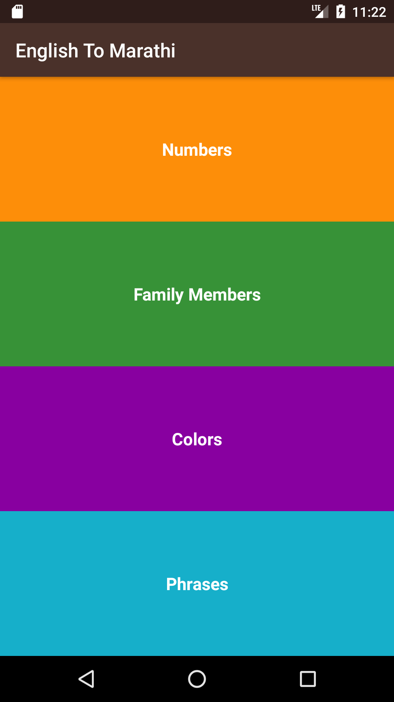
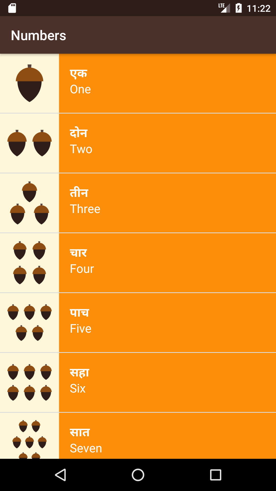
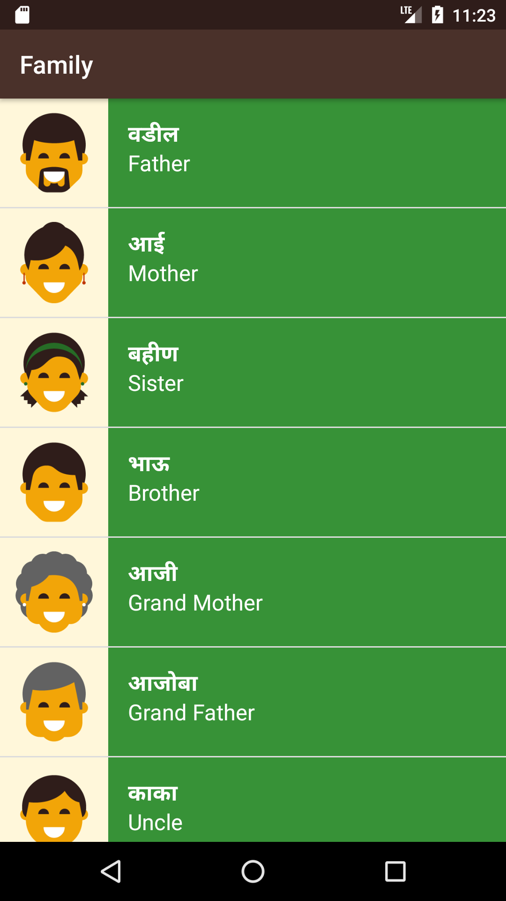
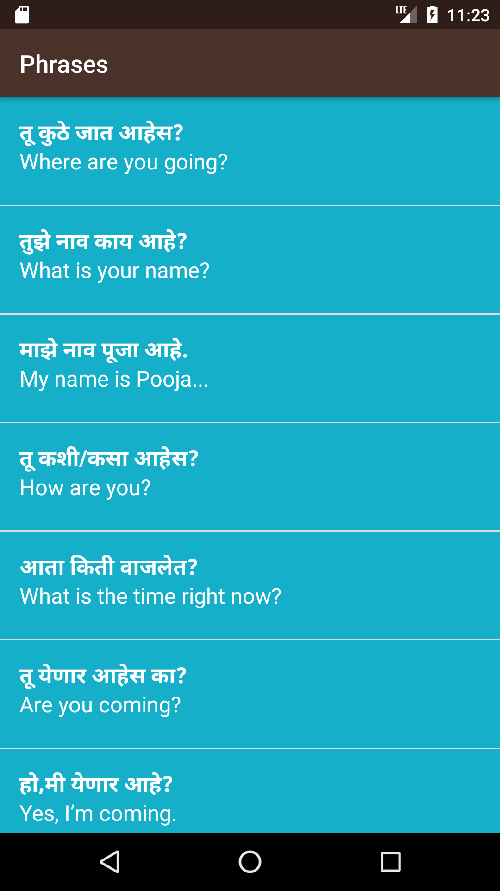

English To Marathi App
===================================

This app displays lists of vocabulary words for the user to learn the Marathi language.
I have developed this app in the Beginner's AndroidUdacity course.

Download .apk file here - https://github.com/mahajan-pooja/English-To-Marathi/blob/gh-pages/app-debug.apk

Pre-requisites
--------------

- Android SDK v23
- Android Build Tools v23.0.2
- Android Support Repository v23.3.0

Getting Started
---------------

This sample uses the Gradle build system. To build this project, use the
"gradlew build" command or use "Import Project" in Android Studio.

SCREENSHOTS:

